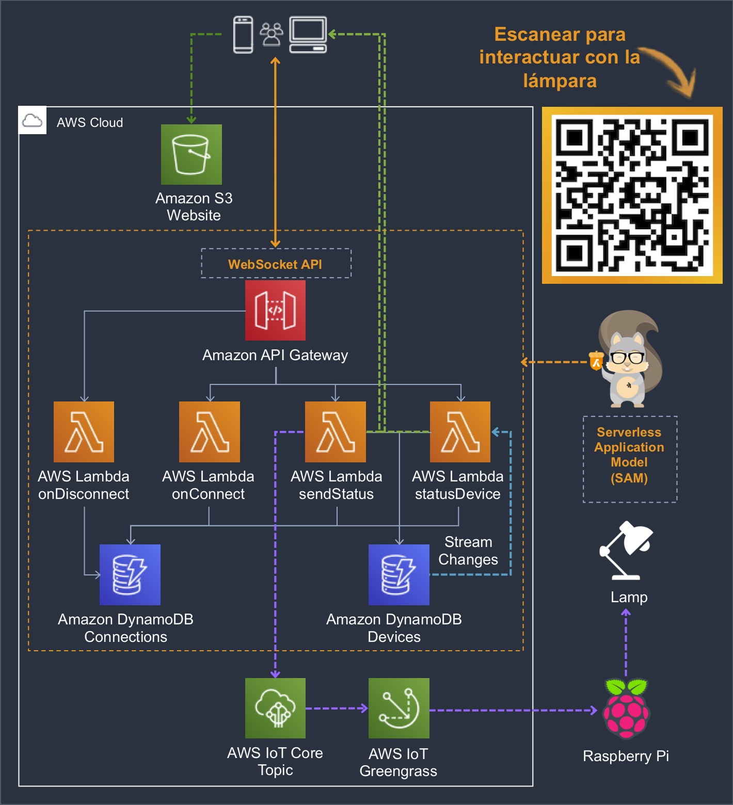

# SAM - Websockets with Amazon API Gateway

With this project using SAM (Serverless Application Model) you can deploy the AWS services required to have a web page where you can turn a light on and off using Websockets with Amazon API Gateway.

**Diagram architecture**



**Web page**


## Deploy using AWS CLI commands

Install the [AWS SAM CLI](https://docs.aws.amazon.com/serverless-application-model/latest/developerguide/serverless-sam-cli-install.html) and use it to package, deploy, and describe your application.  These are the commands you'll need to use:

```
sam package \
    --template-file template.yaml \
    --output-template-file packaged.yaml \
    --s3-bucket REPLACE_THIS_WITH_YOUR_EXISTING_S3_BUCKET_NAME

sam deploy \
    --template-file packaged.yaml \
    --stack-name sam-websocket-api-gateway \
    --capabilities CAPABILITY_IAM \
    --parameter-overrides WebsiteName=REPLACE_THIS_WITH_YOUR_WEBSITE_S3_BUCKET_NAME_TO_CREATE

aws cloudformation describe-stacks \
    --stack-name sam-websocket-api-gateway --query 'Stacks[].Outputs'
```

## Upload website

In file **html/index.html** replace **wss://your-websocket-uri** with your **WebSocketURI** and upload the files to your bucket.

```
aws s3 cp html/ s3://REPLACE_THIS_WITH_YOUR_WEBSITE_S3_BUCKET_NAME_CREATED/ --recursive --exclude ".git/*" --acl public-read
```

## Add device record to DynamoDB Table

Add the following device to **iot_devices** DynamoDB table.

